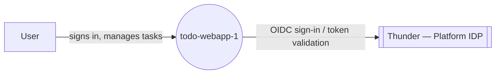
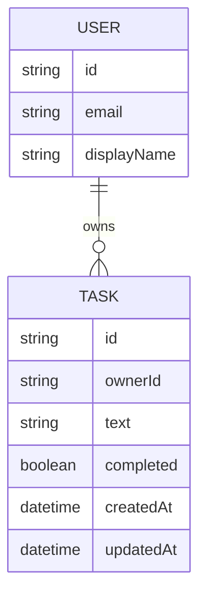
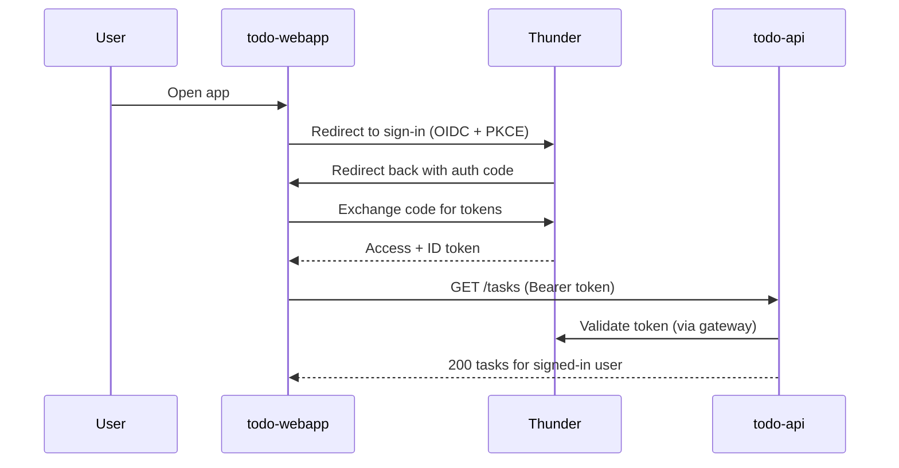
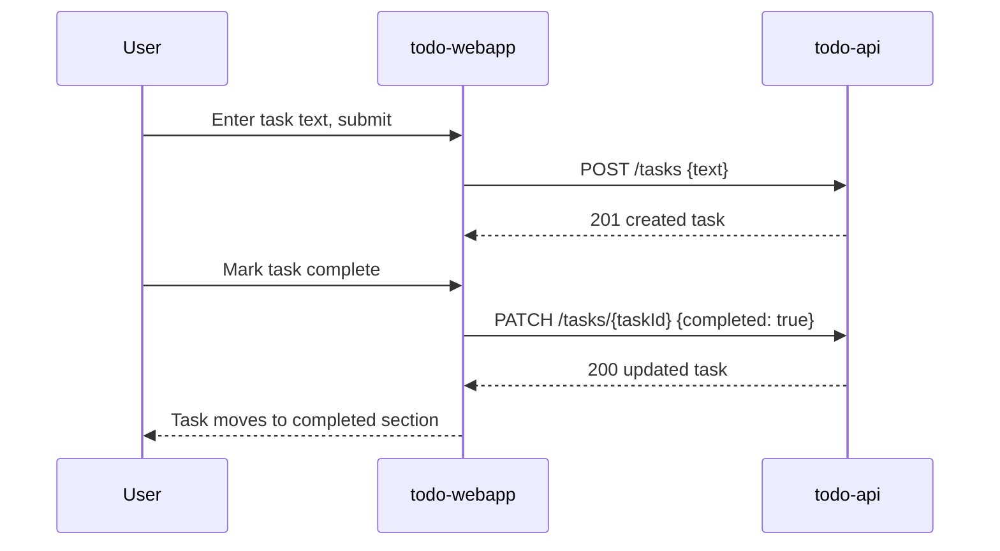
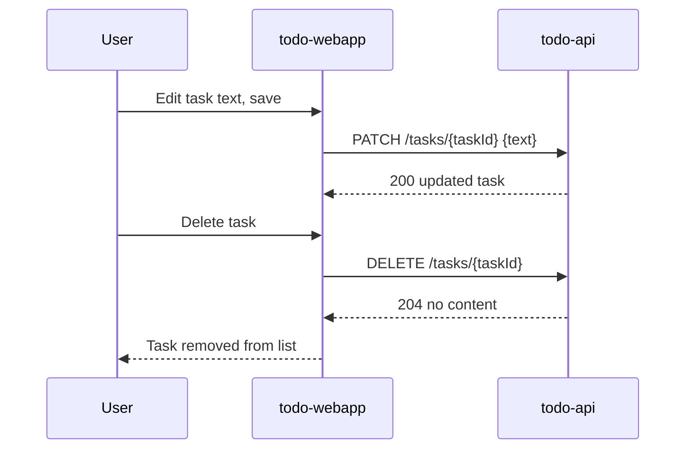

# todo-webapp-1 — Design

## Overview

A minimal, personal todo application. Users sign in via Thunder SSO and use a
single-page React app (`todo-webapp`) to manage their own flat list of tasks.
The webapp holds no data itself: every read or write goes through the
Ballerina backend (`todo-api`), which persists tasks in its own database and
scopes every operation to the signed-in caller's identity, resolved from the
Thunder-validated token injected by the gateway.

## Context (C1)

## Domain model (ER)

`USER` is resolved from the Thunder-validated token, not stored by this
system beyond the id used to scope tasks. `TASK` is the only entity `todo-api`
persists.

## Key flows

### Sign in

### Add and complete a task

### Edit and delete a task

